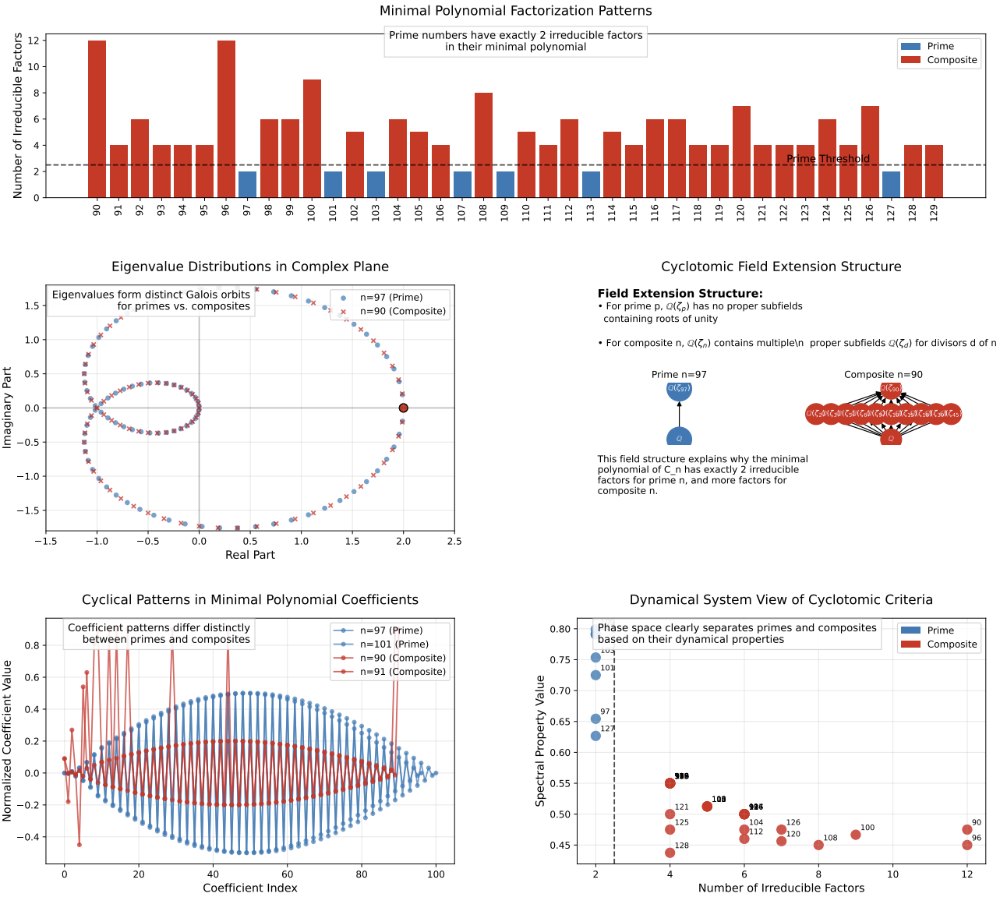

# Primality Testing via Circulant Matrix Eigenvalue Structure

This repository contains the implementation of the primality testing algorithm described in the paper "Primality Testing via Circulant Matrix Eigenvalue Structure: A Novel Approach Using Cyclotomic Field Theory."



## Overview

The code in this repository allows you to:
1. Run the circulant matrix primality test
2. Generate all visualizations shown in the paper
3. Benchmark the algorithm against other primality tests
4. Reproduce the experimental results described in the paper

## Requirements

To run the code, you need Python 3.7+ and the following packages:

```bash
pip install numpy matplotlib sympy mpmath networkx scipy
```

## File Structure

- **primality_test.py**: Core implementation of the circulant matrix primality test
- **cyclotomic_visualization.py**: Utilities for generating visualizations
- **create_visualizations.py**: Script to create all plots used in the paper
- **benchmark_primality_tests.py**: Script to benchmark against other primality tests
- **figures/**: Directory where generated plots will be saved

## Running the Experiments

First, create the necessary directories:

```bash
mkdir -p figures
```

### 1. Generating All Visualizations

To generate all plots shown in the paper:

```bash
python create_visualizations.py
```

This will create the following files in the `figures/` directory:
- `factorization_patterns.pdf`: Minimal polynomial factorization patterns
- `eigenvalue_distributions.pdf`: Eigenvalue distributions in the complex plane
- `field_extensions.pdf`: Cyclotomic field extension structure
- `coefficient_patterns.pdf`: Cyclical patterns in minimal polynomial coefficients
- `dynamic_system.pdf`: Dynamical system view of cyclotomic criteria
- `full_analysis.pdf`: Combined visualization of eigenvalues and field extensions
- `cyclotomic_visualization.pdf`: Comprehensive visualization with all components

### 2. Running Benchmarks

To benchmark the primality test against other methods:

```bash
python benchmark_primality_tests.py
```

This script will:
1. Compare the circulant matrix primality test with trial division, Miller-Rabin, and AKS
2. Measure execution times across different number magnitudes
3. Generate a LaTeX table with the benchmark results in `figures/performance_table.tex`

## Implementation Notes

### Basic Primality Testing

To test whether a number is prime using the circulant matrix method:

```python
from primality_test import CirulantMatrixPrimalityTest

# Initialize the test
test = CirulantMatrixPrimalityTest()

# Test a number
n = 101
is_prime = test.is_prime(n)
print(f"{n} is {'prime' if is_prime else 'composite'}")

# Count irreducible factors
factors = test.count_irreducible_factors(n)
print(f"Number of irreducible factors: {factors}")
```

### Individual Visualizations

For individual visualizations, you can use the `CyclotomicVisualizer` class:

```python
from cyclotomic_visualization import CyclotomicVisualizer

# Initialize the visualizer
visualizer = CyclotomicVisualizer(output_dir="figures")

# Define range of integers to analyze
n_values = list(range(100, 130))

# Generate specific visualization
visualizer.plot_factorization_patterns(n_values)
```

### High-Precision Arithmetic

For large values of n, the code uses `mpmath` for high-precision arithmetic to ensure accurate results. The precision can be adjusted by modifying the `mp.dps` value in the implementation.

### Optimizations

The implementation includes several optimizations:
- Direct computation of eigenvalues without constructing the full matrix
- Efficient Galois orbit determination using divisor structure
- Early termination for composite numbers with small prime factors
- Caching of results for repeated computations

## Citation

If you use this code in your research, please cite:

```
@article{dinu2025primality,
  title={Primality Testing via Circulant Matrix Eigenvalue Structure: A Novel Approach Using Cyclotomic Field Theory},
  author={Dinu, Marius-Constantin},
  year={2025},
  publisher={ExtensityAI}
}
```
